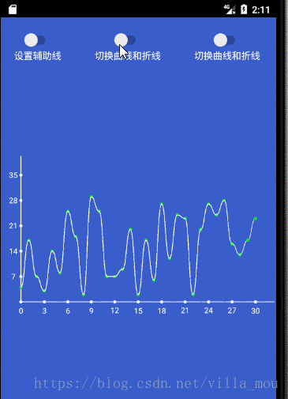
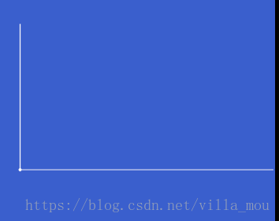
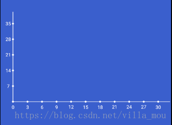
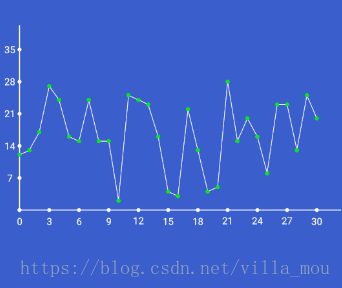
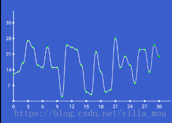
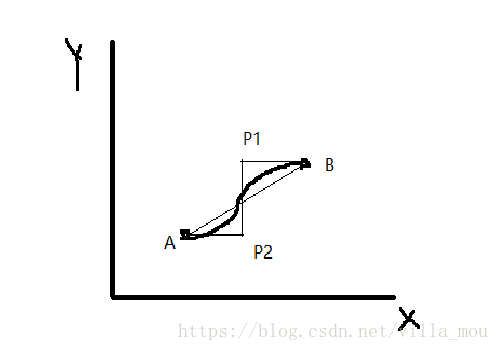
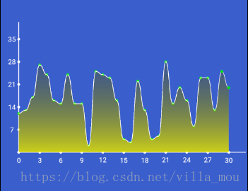
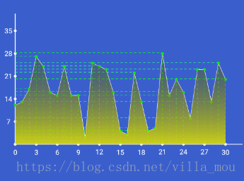
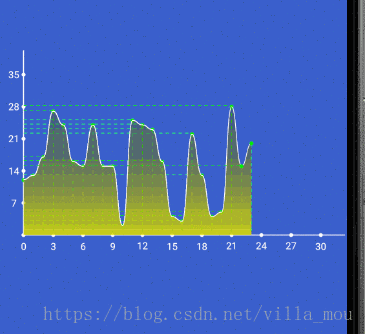

# ChartView
一个折线图和曲线图的控件
### 概述
&emsp;&emsp;今天花了一天时间绘制了一个自定义的曲线图和折线图的自定义控件,可以说现在是身心疲惫了,有点累,下班回家写这篇博客总结下自己的绘制思路,如果有人喜欢的话,麻烦给个star了^_^;
&emsp;&emsp; 其实这类曲线,折线和柱状图的库现在特别多,而且也已经特别成熟了,目前使用对多的应该是[hellochart](https://github.com/lecho/hellocharts-android)，[mpandroidchart](https://github.com/PhilJay/MPAndroidChart)这两个库，这两个库我之前在项目中还用过,扩展性真的超级强,而且基本包含了市面上能用到的大部分效果了,不过就是使用的时候有点麻烦,API特别多,有的效果找了好久才找到,不过有轮子用还是很高兴的;
### 效果展示
&emsp;&emsp;这个控件主要的功能有折线图,曲线图,点的x,y的辅助虚线,区域渐变覆盖等,当然如果你需要更多的功能,也可以在此基础上进行扩展,比如可以增加具体的值在点的上方等,不过目前我只做了这些功能,其他的有时间再拓展吧;
&emsp;&emsp;看下具体的效果:
　<center></center>
### 实现分析
首先理一下思路,看到这种控件首先要明确绘制的流程,先要绘制什么,后要绘制什么,具体再怎么做等等
这里说下我的绘制思路:

* 1,先绘制坐标系,然后绘制坐标系上的点,再绘制坐标系上的文字
* 2,然后开始绘制折线图和曲线图
* 3,之后开始绘制虚线和点
* 4,最后绘制覆盖的渐变区域
* 5,加入绘制的动画效果

我的具体实现步骤大概就是这个样子;

### 绘制
##### 初始化
绘制前肯定要初始化各种画笔,已经设置控件的宽高等操作;
首先初始化画笔

```
 // 绘制坐标系的画笔
    private var mPaintCdt: Paint = Paint(Paint.ANTI_ALIAS_FLAG)
    //绘制坐标系上刻度点的画笔
    private var mPaintSysPoint: Paint = Paint(Paint.ANTI_ALIAS_FLAG)
    //绘制折线上的点的画笔
    private var mPaintLinePoint: Paint = Paint(Paint.ANTI_ALIAS_FLAG)
    //绘制文字的画笔
    private var mPaintText: Paint = Paint(Paint.ANTI_ALIAS_FLAG)
    //绘制折线的画笔
    private var mPaintLine: Paint = Paint(Paint.ANTI_ALIAS_FLAG)
    //绘制虚线的画笔
    private var mPaintDash: Paint = Paint(Paint.ANTI_ALIAS_FLAG)
    //x,y轴的画笔
    private var mPaintSys: Paint = Paint(Paint.ANTI_ALIAS_FLAG)
    //绘制覆盖区域
    private var mPaintFillArea: Paint = Paint(Paint.ANTI_ALIAS_FLAG)
 //初始化画笔
    private fun initPaint() {
        //虚线需要关闭硬件加速
        setLayerType(LAYER_TYPE_SOFTWARE, null)

        mPaintCdt.style = Paint.Style.STROKE
        mPaintCdt.strokeWidth = brokenLineSize
        mPaintCdt.color = brokenLineColor

        mPaintLinePoint.style = Paint.Style.FILL
        mPaintLinePoint.color = brokenLinePointColor

        mPaintSysPoint.color = coordinateSystemPointColor

        mPaintSys.style = Paint.Style.STROKE
        mPaintSys.strokeWidth = coordinateSystemSize
        mPaintSys.color = coordinateSystemColor

        mPaintText.textAlign = Paint.Align.CENTER
        mPaintText.color = Color.WHITE
        mPaintText.textSize = 30f

        mPaintFillArea.color = Color.YELLOW
        mPaintFillArea.style = Paint.Style.FILL

        mPaintLine.style = Paint.Style.STROKE
        mPaintLine.strokeWidth = brokenLineSize
        mPaintLine.color = brokenLineColor

        mPaintDash = Paint()
        mPaintDash.style = Paint.Style.STROKE
        mPaintDash.strokeWidth = dashSize
        mPaintDash.color = dashColor
        mPaintDash.pathEffect = DashPathEffect(floatArrayOf(10f, 10f), 0f)

        mXBound = Rect()
        mYBound = Rect()

    }
```

这里要注意一个点,就是绘制虚线是要关闭硬件加速的,关闭方法` setLayerType(LAYER_TYPE_SOFTWARE, null)`
还有怎么设置为绘制虚线,通过` mPaintDash.pathEffect = DashPathEffect(floatArrayOf(10f, 10f), 0f)`
`floatArrayOf(10f, 10f)`表示的意思是这条线上面10个像素的实线，10个像素的虚线;

然后开始设置宽高,具体代码如下:

```
    override fun onMeasure(widthMeasureSpec: Int, heightMeasureSpec: Int) {
        super.onMeasure(widthMeasureSpec, heightMeasureSpec)
        setMeasuredDimension(measureSpec(widthMeasureSpec), measureSpec(heightMeasureSpec))
    }

    private fun measureSpec(heightMeasureSpec: Int): Int {
        var result: Int
        val specSize = View.MeasureSpec.getSize(heightMeasureSpec) //获取高的高度 单位 为px
        val specMode = View.MeasureSpec.getMode(heightMeasureSpec)//获取测量的模式
        //如果是精确测量，就将获取View的大小设置给将要返回的测量值
        if (specMode == View.MeasureSpec.EXACTLY) {
            result = specSize
        } else {
            result = 400
            //如果设置成wrap_content时，给高度指定一个值
            if (specMode == View.MeasureSpec.AT_MOST) {
                result = Math.min(result, specSize)
            }
        }
        return result
    }
```
然后获取控件的高度和宽度,并且这里可以根据宽高设置渐变的shader了;

```
  override fun onSizeChanged(w: Int, h: Int, oldw: Int, oldh: Int) {
        super.onSizeChanged(w, h, oldw, oldh)
        //获取当前View的宽高
        mViewWidth = w
        mViewHeight = h
        //渐变
        mShader = LinearGradient(mViewWidth.toFloat(), mViewHeight.toFloat(), mViewWidth.toFloat(), 0f, intArrayOf(Color.YELLOW, Color.TRANSPARENT), null, Shader.TileMode.REPEAT)
    }
```

##### 绘制
现在就可以开始进行绘制了,绘制之前我们要根据设置的数据来进行绘制,所以要提供设置数据的方法

```
    fun setChartPoints(points: ArrayList<Int>) {
        pointList = ArrayList()
        points.forEachIndexed { index, value ->
            val point = Point()
            point.x = index
            point.y = value
            pointList.add(point)
        }
        val yPointArray = arrayListOf<Int>()

        for (i in pointList.indices) {
            yPointArray.add( pointList[i].y)
        }
        if (maxY == -1) {
            maxY = max(yPointArray)
        }
        maxX = points.size
        //默认x有10格，y5格，这里你可以修改
        xScale = maxX / 10
        yScale = maxY / 5
        initAnimator(maxX)
        invalidate()
    }
```
这里我默认设置的是x分为10段,y分为5段,这个是可以随意修改的;
并且我还设置了y轴的最大值可以手动设置,如果没有手动设置那么我是根据你数据中的最大值来进行设置的;
```
//传入点的Y的最大坐标
    var maxY: Int = -1
        set(value) {
            field = value
            invalidate()
        }
```
这样设置数据的操作就好了;接下来还需要在绘制之前需要计算x轴和y轴每段的具体值,通过平分view的宽高来计算
代码如下:
```
  private val getWidthAndHeight = {
        //x轴上需要绘制的刻度的个数
        val numX = maxX / xScale
        //每格的宽度
        everyXwidth = (mViewWidth - margin * 2) / (numX * 1f)
        //y轴上需要绘制的刻度的个数
        val numY = maxY / yScale
        //每格的高度
        everyYheight = (mViewHeight - margin * 2) / (numY * 1f)
    }

```
然后就可以进行绘制了
首先绘制**坐标系和坐标原点**,代码如下:

```
 //绘制X轴Y轴 以及原点
    private val drawCoordinate = { canvas: Canvas ->
        canvas.drawLine(margin.toFloat(), (mViewHeight - margin).toFloat(), margin.toFloat(), 5f, mPaintSys)
        canvas.drawLine(margin.toFloat(), (mViewHeight - margin).toFloat(), (mViewWidth - 5).toFloat(), (mViewHeight - margin).toFloat(), mPaintSys)
        canvas.drawCircle(margin.toFloat(), (mViewHeight - margin).toFloat(), SystemPointRadius, mPaintSysPoint)
    }

```
效果如下:
　<center></center>
然后绘制坐标系上**x,y轴刻度标记和小圆点;**
代码如下:
```
    private val drawCalibration = { canvas: Canvas ->
        //x轴上的点
        for (i in pointList.indices) {
            canvas.drawCircle(margin + i * everyXwidth, (mViewHeight - margin).toFloat(), SystemPointRadius, mPaintSysPoint)
            val indexX = (i * xScale).toString()
            if (indexX.toInt() <= maxX) {
                //将TextView 的文本放入一个矩形中， 测量TextView的高度和宽度
                mPaintText.getTextBounds(indexX, 0, indexX.length, mXBound)
                canvas.drawText(indexX, margin + i * everyXwidth, (mViewHeight - margin + 2 * mXBound.height()).toFloat(), mPaintText)
            }
        }

        //绘制y轴文字
        for (i in 0..maxY) {
            canvas.drawCircle(margin.toFloat(), mViewHeight.toFloat() - margin.toFloat() - i * everyYheight, SystemPointRadius, mPaintSysPoint)
            val indexY = (i * yScale).toString()
            //这里直接测量"0",不然会因为0和1或者其他的长度不同导致位置有点问题
            mPaintText.getTextBounds("0", 0, "0".length, mYBound)
            if (i != 0) {
                canvas.drawText(indexY, margin.toFloat() - 2 * mYBound.width(), mViewHeight.toFloat() - margin.toFloat() - i * everyYheight + mYBound.height() / 2, mPaintText)
            }
        }
    }
```
效果如下:
　<center></center>

之后就开始绘制**折线图和曲线图**了
这里我搞了个注释来判断是需要绘制折现还是曲线,随便提一下,kotlin的注释和java的注释写法上面还是有点区别的;

```
@IntDef(value = [CURVELINE, BROKENLINE], flag = false)
@Retention(AnnotationRetention.SOURCE)
annotation class LineType
//曲线
const val CURVELINE = 1
//折线
const val BROKENLINE = 2
```
然后绑定给控件的成员变量,默认是曲线图
```
   //线的类型，默认是折线
    @LineType
    var lineType: Int = CURVELINE
        set(value) {
            field = value
            initAnimator(maxX)
            invalidate()
        }
```
接下来是绘制的代码

```
 when (lineType) {
            BROKENLINE -> {
                drawBrokenLine(canvas)
            }
            CURVELINE -> {
                drawCurve(canvas)
            }
        }
	/**
     * 绘制曲线
     */
    private val drawCurve = { canvas: Canvas ->
        val path = Path()
        val zeroPoint = Point()
        zeroPoint.x = (margin + pointList[0].x / (xScale * 1f) * everyXwidth).toInt()
        zeroPoint.y = (mViewHeight - margin - pointList[0].y / (yScale * 1f) * everyYheight).toInt()
        path.moveTo(zeroPoint.x.toFloat(), zeroPoint.y.toFloat())
        for (i in 0 until mAnimatorValue - 1) {
            val startX = pointList[i].x / (xScale * 1f) * everyXwidth
            val startY = pointList[i].y / (yScale * 1f) * everyYheight
            val startPx = margin + startX
            val startPy = mViewHeight.toFloat() - margin.toFloat() - startY
            val endX = pointList[i + 1].x / (xScale * 1f) * everyXwidth
            val endY = pointList[i + 1].y / (yScale * 1f) * everyYheight
            val endPx = margin + endX
            val endPy = mViewHeight.toFloat() - margin.toFloat() - endY
            val wt = (startPx + endPx) / 2
            val p3 = Point()
            val p4 = Point()
            p3.y = startPy.toInt()
            p3.x = wt.toInt()
            p4.y = endPy.toInt()
            p4.x = wt.toInt()
            path.cubicTo(p3.x.toFloat(), p3.y.toFloat(), p4.x.toFloat(), p4.y.toFloat(), endPx, endPy)
            canvas.drawPath(path, mPaintLine)
            //这里绘制两次是为了把线盖住，效果更好
            if (i != 1) {
                canvas.drawCircle(startPx, startPy, brokenLinePointRadius, mPaintLinePoint)
            }
            canvas.drawCircle(endPx, endPy, brokenLinePointRadius, mPaintLinePoint)
        }
    }

    /**
     * 绘制折线
     * *计算绘制点的坐标位置
     * 绘制点的坐标 =  (传入点的的最大的x，y坐标/坐标轴上的间隔） * 坐标间隔对应的屏幕上的间隔
     */
    private val drawBrokenLine = { canvas: Canvas ->
        val zeroPoint = Point()
        zeroPoint.x = (margin + pointList[0].x / (xScale * 1f) * everyXwidth).toInt()
        zeroPoint.y = (mViewHeight - margin - pointList[0].y / (yScale * 1f) * everyYheight).toInt()
        for (i in 1 until mAnimatorValue) {
            //计算出脱离坐标系的点所处的位置
            val pointX = pointList[i].x / (xScale * 1f) * everyXwidth
            val pointY = pointList[i].y / (yScale * 1f) * everyYheight

            //坐标系内的点的位置
            val startX = zeroPoint.x.toFloat()
            val startY = zeroPoint.y.toFloat()
            val endX = margin + pointX
            val endY = mViewHeight.toFloat() - margin.toFloat() - pointY
            canvas.drawLine(startX, startY, endX, endY, mPaintLine)
            //这里绘制两次是为了把线盖住，效果更好
            canvas.drawCircle(startX, startY, brokenLinePointRadius, mPaintLinePoint)
            canvas.drawCircle(endX, endY, brokenLinePointRadius, mPaintLinePoint)
            //记录上一个坐标点的位置
            zeroPoint.x = endX.toInt()
            zeroPoint.y = endY.toInt()
        }
    }

```
效果图
　<center></center>
　　<center></center>

这里提一下曲线我是采用的三阶贝赛尔曲线进行绘制的,先取前后两个点的x的中点,设置给两个额外点的x值,两个额外点的y值分别设置为两个点的y值,具体的绘制的点的设置原理如下图;


接下来就是绘制覆盖渐变的区域,这里设置了一个boolean值fillArea来设置是否需要覆盖区域,如果需要才进行绘制;
代码如下

```
 /**
     * 绘制曲线
     */
    private val drawCurve = { canvas: Canvas ->
        val fillPath = Path()
        val path = Path()
        val zeroPoint = Point()
        zeroPoint.x = (margin + pointList[0].x / (xScale * 1f) * everyXwidth).toInt()
        zeroPoint.y = (mViewHeight - margin - pointList[0].y / (yScale * 1f) * everyYheight).toInt()
        if (fillArea) {
            //移动到原点
            fillPath.moveTo(margin.toFloat(), (mViewHeight - margin).toFloat())
            fillPath.lineTo(zeroPoint.x.toFloat(), zeroPoint.y.toFloat())
        }
        path.moveTo(zeroPoint.x.toFloat(), zeroPoint.y.toFloat())
        for (i in 0 until mAnimatorValue - 1) {
            val startX = pointList[i].x / (xScale * 1f) * everyXwidth
            val startY = pointList[i].y / (yScale * 1f) * everyYheight
            val startPx = margin + startX
            val startPy = mViewHeight.toFloat() - margin.toFloat() - startY
            val endX = pointList[i + 1].x / (xScale * 1f) * everyXwidth
            val endY = pointList[i + 1].y / (yScale * 1f) * everyYheight
            val endPx = margin + endX
            val endPy = mViewHeight.toFloat() - margin.toFloat() - endY
            val wt = (startPx + endPx) / 2
            val p3 = Point()
            val p4 = Point()
            p3.y = startPy.toInt()
            p3.x = wt.toInt()
            p4.y = endPy.toInt()
            p4.x = wt.toInt()
            path.cubicTo(p3.x.toFloat(), p3.y.toFloat(), p4.x.toFloat(), p4.y.toFloat(), endPx, endPy)
            if (fillArea) {
                fillPath.cubicTo(p3.x.toFloat(), p3.y.toFloat(), p4.x.toFloat(), p4.y.toFloat(), endPx, endPy)
                if (i == mAnimatorValue - 2) {
                    fillPath.lineTo(endPx, mViewHeight.toFloat() - margin.toFloat())
                    fillPath.close()
                    mPaintFillArea.shader = mShader
                    canvas.drawPath(fillPath, mPaintFillArea)
                }
            }
            canvas.drawPath(path, mPaintLine)
            //这里绘制两次是为了把线盖住，效果更好
            if (i != 1) {
                canvas.drawCircle(startPx, startPy, brokenLinePointRadius, mPaintLinePoint)
            }
            canvas.drawCircle(endPx, endPy, brokenLinePointRadius, mPaintLinePoint)
        }
    }

    /**
     * 绘制折线
     * *计算绘制点的坐标位置
     * 绘制点的坐标 =  (传入点的的最大的x，y坐标/坐标轴上的间隔） * 坐标间隔对应的屏幕上的间隔
     */
    private val drawBrokenLine = { canvas: Canvas ->

        val zeroPoint = Point()
        zeroPoint.x = (margin + pointList[0].x / (xScale * 1f) * everyXwidth).toInt()
        zeroPoint.y = (mViewHeight - margin - pointList[0].y / (yScale * 1f) * everyYheight).toInt()
        val fillPath = Path()
        if (fillArea) {
            //移动到原点
            fillPath.moveTo(margin.toFloat(), (mViewHeight - margin).toFloat())
            fillPath.lineTo(zeroPoint.x.toFloat(), zeroPoint.y.toFloat())
        }
        for (i in 1 until mAnimatorValue) {
            //计算出脱离坐标系的点所处的位置
            val pointX = pointList[i].x / (xScale * 1f) * everyXwidth
            val pointY = pointList[i].y / (yScale * 1f) * everyYheight

            //坐标系内的点的位置
            val startX = zeroPoint.x.toFloat()
            val startY = zeroPoint.y.toFloat()
            val endX = margin + pointX
            val endY = mViewHeight.toFloat() - margin.toFloat() - pointY
            canvas.drawLine(startX, startY, endX, endY, mPaintLine)
            //这里绘制两次是为了把线盖住，效果更好
            canvas.drawCircle(startX, startY, brokenLinePointRadius, mPaintLinePoint)
            canvas.drawCircle(endX, endY, brokenLinePointRadius, mPaintLinePoint)
            //记录上一个坐标点的位置
            zeroPoint.x = endX.toInt()
            zeroPoint.y = endY.toInt()
            if (fillArea) {
                fillPath.lineTo(startX, startY)
                if (i == mAnimatorValue - 1) {
                    fillPath.lineTo(endX, endY)
                    fillPath.lineTo(endX, mViewHeight.toFloat() - margin.toFloat())
                    fillPath.close()
                    mPaintFillArea.shader = mShader
                    canvas.drawPath(fillPath, mPaintFillArea)
                }
            }
        }
    }
```
再来看一下效果:
　<center></center>

接着开始添加辅助的虚线,同样是通过一个boolean值isShowDash进行设置是否需要设置;
代码如下

```

    /**
     * 绘制曲线
     */
    private val drawCurve = { canvas: Canvas ->
        val fillPath = Path()
        val path = Path()
        val zeroPoint = Point()
        zeroPoint.x = (margin + pointList[0].x / (xScale * 1f) * everyXwidth).toInt()
        zeroPoint.y = (mViewHeight - margin - pointList[0].y / (yScale * 1f) * everyYheight).toInt()
        if (fillArea) {
            //移动到原点
            fillPath.moveTo(margin.toFloat(), (mViewHeight - margin).toFloat())
            fillPath.lineTo(zeroPoint.x.toFloat(), zeroPoint.y.toFloat())
        }
        path.moveTo(zeroPoint.x.toFloat(), zeroPoint.y.toFloat())
        for (i in 0 until mAnimatorValue - 1) {
            val startX = pointList[i].x / (xScale * 1f) * everyXwidth
            val startY = pointList[i].y / (yScale * 1f) * everyYheight
            val startPx = margin + startX
            val startPy = mViewHeight.toFloat() - margin.toFloat() - startY
            val endX = pointList[i + 1].x / (xScale * 1f) * everyXwidth
            val endY = pointList[i + 1].y / (yScale * 1f) * everyYheight
            val endPx = margin + endX
            val endPy = mViewHeight.toFloat() - margin.toFloat() - endY
            val wt = (startPx + endPx) / 2
            val p3 = Point()
            val p4 = Point()
            p3.y = startPy.toInt()
            p3.x = wt.toInt()
            p4.y = endPy.toInt()
            p4.x = wt.toInt()
            path.cubicTo(p3.x.toFloat(), p3.y.toFloat(), p4.x.toFloat(), p4.y.toFloat(), endPx, endPy)
            if (fillArea) {
                fillPath.cubicTo(p3.x.toFloat(), p3.y.toFloat(), p4.x.toFloat(), p4.y.toFloat(), endPx, endPy)
                if (i == mAnimatorValue - 2) {
                    fillPath.lineTo(endPx, mViewHeight.toFloat() - margin.toFloat())
                    fillPath.close()
                    mPaintFillArea.shader = mShader
                    canvas.drawPath(fillPath, mPaintFillArea)
                }
            }
            canvas.drawPath(path, mPaintLine)
            //这里绘制两次是为了把线盖住，效果更好
            if (i != 1) {
                canvas.drawCircle(startPx, startPy, brokenLinePointRadius, mPaintLinePoint)
            }
            canvas.drawCircle(endPx, endPy, brokenLinePointRadius, mPaintLinePoint)
            if (isShowDash) {
                //绘制横向虚线
                canvas.drawLine(margin.toFloat(), mViewHeight.toFloat() - margin.toFloat() - startY - brokenLinePointRadius / 2, margin + startX - brokenLinePointRadius / 2, mViewHeight.toFloat() - margin.toFloat() - startY - brokenLinePointRadius / 2, mPaintDash)
                //绘制竖向虚线
                canvas.drawLine(endPx, endPy, endPx, mViewHeight.toFloat() - margin.toFloat() - brokenLinePointRadius, mPaintDash)
            }
        }
    }

    /**
     * 绘制折线
     * *计算绘制点的坐标位置
     * 绘制点的坐标 =  (传入点的的最大的x，y坐标/坐标轴上的间隔） * 坐标间隔对应的屏幕上的间隔
     */
    private val drawBrokenLine = { canvas: Canvas ->

        val zeroPoint = Point()
        zeroPoint.x = (margin + pointList[0].x / (xScale * 1f) * everyXwidth).toInt()
        zeroPoint.y = (mViewHeight - margin - pointList[0].y / (yScale * 1f) * everyYheight).toInt()
        val fillPath = Path()
        if (fillArea) {
            //移动到原点
            fillPath.moveTo(margin.toFloat(), (mViewHeight - margin).toFloat())
            fillPath.lineTo(zeroPoint.x.toFloat(), zeroPoint.y.toFloat())
        }
        for (i in 1 until mAnimatorValue) {
            //计算出脱离坐标系的点所处的位置
            val pointX = pointList[i].x / (xScale * 1f) * everyXwidth
            val pointY = pointList[i].y / (yScale * 1f) * everyYheight

            //坐标系内的点的位置
            val startX = zeroPoint.x.toFloat()
            val startY = zeroPoint.y.toFloat()
            val endX = margin + pointX
            val endY = mViewHeight.toFloat() - margin.toFloat() - pointY
            canvas.drawLine(startX, startY, endX, endY, mPaintLine)
            //这里绘制两次是为了把线盖住，效果更好
            canvas.drawCircle(startX, startY, brokenLinePointRadius, mPaintLinePoint)
            canvas.drawCircle(endX, endY, brokenLinePointRadius, mPaintLinePoint)
            //记录上一个坐标点的位置
            zeroPoint.x = endX.toInt()
            zeroPoint.y = endY.toInt()

            if (isShowDash) {
                //绘制横向虚线
                canvas.drawLine(margin.toFloat(), mViewHeight.toFloat() - margin.toFloat() - pointY - brokenLinePointRadius / 2, margin + pointX - brokenLinePointRadius / 2, mViewHeight.toFloat() - margin.toFloat() - pointY - brokenLinePointRadius / 2, mPaintDash)
                //绘制竖向虚线
                canvas.drawLine(zeroPoint.x.toFloat(), zeroPoint.y.toFloat(), zeroPoint.x.toFloat(), mViewHeight.toFloat() - margin.toFloat() - brokenLinePointRadius, mPaintDash)
            }

            if (fillArea) {
                fillPath.lineTo(startX, startY)
                if (i == mAnimatorValue - 1) {
                    fillPath.lineTo(endX, endY)
                    fillPath.lineTo(endX, mViewHeight.toFloat() - margin.toFloat())
                    fillPath.close()
                    mPaintFillArea.shader = mShader
                    canvas.drawPath(fillPath, mPaintFillArea)
                }
            }
        }
    }
```
看下现在的效果:
　<center></center>

最后进行给绘制过程加上动画效果:
具体代码如下:

```
    private lateinit var valueAnimator: ValueAnimator
    private var mAnimatorValue: Int = 0
    private lateinit var mUpdateListener: ValueAnimator.AnimatorUpdateListener
    private val defaultDuration = 2000

    private fun initAnimator(maxX: Int) {
        valueAnimator = ValueAnimator.ofInt(0, maxX).setDuration(defaultDuration.toLong())
        mUpdateListener = ValueAnimator.AnimatorUpdateListener { animation ->
            mAnimatorValue = animation.animatedValue as Int
            invalidate()
        }
        valueAnimator.addUpdateListener(mUpdateListener)
        valueAnimator.start()
    }
```
这样一个曲线和折现图就绘制完成了,再来看下效果:
　<center></center>
项目已经传到GitHub,如果喜欢,麻烦给个star,非常感谢
[github地址:](https://github.com/mouxuefei/ChartView)